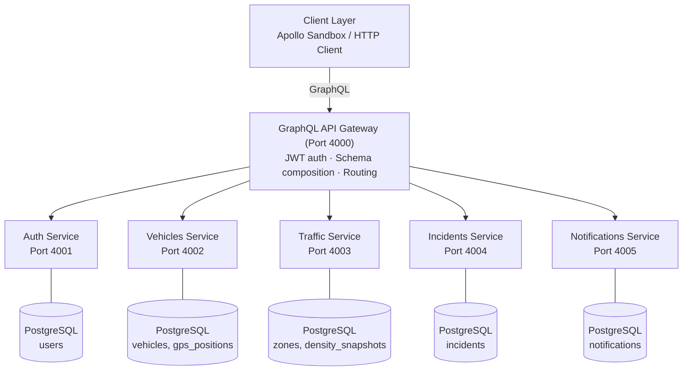
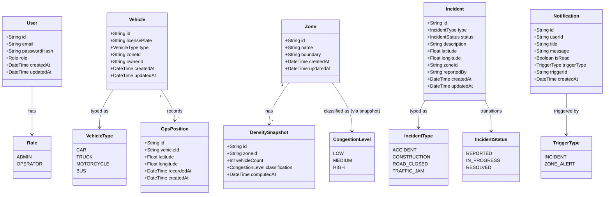
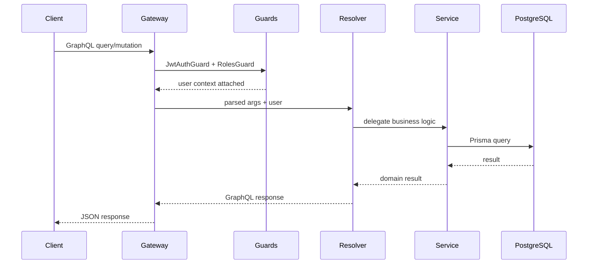
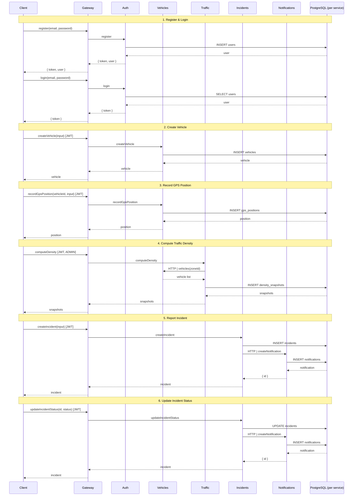

# Smart Urban Traffic Management Platform

A distributed web-service platform for intelligent urban traffic management, built as a university project (Mini Projet – Web Services & GraphQL). The system is composed of five independent NestJS microservices, each with its own PostgreSQL schema, exposed through a unified GraphQL API Gateway.

## Architecture Overview

### High-Level Architecture



### Component Descriptions

1. **Client Layer** — Any HTTP client (Apollo Sandbox, Postman, curl) sends GraphQL queries/mutations to the gateway. Requests carry a JWT in the `Authorization` header for authenticated operations.

2. **GraphQL API Gateway** — The single entry point. It composes the GraphQL schemas from all five services, validates JWT tokens, enforces role-based access, and routes each query/mutation to the appropriate downstream service. The gateway never stores data — it only orchestrates.

3. **Microservices** — Five independent NestJS applications, each owning a single domain:
   - **Auth** — User registration, login, JWT issuance, role guards.
   - **Vehicles** — Vehicle CRUD, GPS position ingestion, movement history queries.
   - **Traffic** — Zone definitions, real-time vehicle density computation, congestion classification (Low / Medium / High).
   - **Incidents** — Incident lifecycle: creation, filtering, mandatory status transitions (Reported → In Progress → Resolved).
   - **Notifications** — Push-style notification creation, listing, and mark-as-read.

4. **PostgreSQL Databases** — Each service has its own dedicated database/schema. Services never access another service's database directly — all cross-service data access is routed through the gateway.

### Data Model (Class Diagram)



### Internal Service Architecture (Layer-Based)

Each microservice follows a consistent layer-based pattern within its `src/` directory:

```
┌──────────────────────────────────────────────────────────────────────┐
│                       Incoming GraphQL Request                        │
└──────────────────────────────┬───────────────────────────────────────┘
                               │
                               ▼
┌──────────────────────────────────────────────────────────────────────┐
│ 1. Guards Layer               (guards/)                              │
│    ├── JwtAuthGuard — extracts & verifies JWT, attaches user        │
│    └── RolesGuard — checks user role against @Roles() metadata      │
└──────────────────────────────┬───────────────────────────────────────┘
                               │
                               ▼
┌──────────────────────────────────────────────────────────────────────┐
│ 2. Decorator Layer           (decorators/)                           │
│    ├── @CurrentUser — extracts authenticated user from context      │
│    └── @Roles — sets role metadata for RolesGuard                   │
└──────────────────────────────┬───────────────────────────────────────┘
                               │
                               ▼
┌──────────────────────────────────────────────────────────────────────┐
│ 3. Strategy Layer            (strategies/)                           │
│    └── JwtStrategy — Passport strategy: decodes & validates JWT     │
└──────────────────────────────┬───────────────────────────────────────┘
                               │
                               ▼
┌──────────────────────────────────────────────────────────────────────┐
│ 4. Resolver Layer            (<domain>.resolver.ts)                  │
│    └── Thin GraphQL handler — parses args, applies guards,          │
│        delegates to service. No business logic.                     │
└──────────────────────────────┬───────────────────────────────────────┘
                               │
                               ▼
┌──────────────────────────────────────────────────────────────────────┐
│ 5. Service Layer             (<domain>.service.ts)                   │
│    └── All domain logic — validation, transformations,              │
│        authorization checks, database calls                         │
└──────────────────────────────┬───────────────────────────────────────┘
                               │
                               ▼
┌──────────────────────────────────────────────────────────────────────┐
│ 6. Providers Layer           (providers/)                            │
│    └── PrismaService + PrismaModule — type-safe DB access           │
└──────────────────────────────┬───────────────────────────────────────┘
                               │
                               ▼
┌──────────────────────────────────────────────────────────────────────┐
│ 7. Database Layer            (PostgreSQL)                            │
│    └── Per-service database, accessed only through Prisma           │
└──────────────────────────────────────────────────────────────────────┘
```

#### Layer Responsibilities

| Layer | Directory | Role |
|---|---|---|
| **Guards** | `guards/` | Authenticate requests (JWT), authorize roles — gatekeepers at the top |
| **Decorators** | `decorators/` | Extract context data (`@CurrentUser`), attach metadata (`@Roles`) |
| **Strategies** | `strategies/` | Passport integration — JWT decode, signature verification |
| **Resolvers** | Root `*.resolver.ts` | Thin GraphQL entry point — parse args, delegate, return |
| **Services** | Root `*.service.ts` | All business logic — validation, transformations, DB queries |
| **Providers** | `providers/` | Shared infrastructure — Prisma client, module config |
| **DTOs** | `dto/` | Input validation schemas with `class-validator` decorators |
| **Entities** | `entities/` | GraphQL `@ObjectType` definitions and enums |

#### Layer Connection Rules

- **Guards always execute before resolvers** — authentication and authorization are applied via `@UseGuards()` on the resolver class or method.
- **Resolvers never contain business logic** — they parse GraphQL args, call `@CurrentUser()` to get the user, and delegate to a single service method.
- **Services never import guards or resolvers** — they are pure domain logic, depending only on providers (Prisma) and DTOs.
- **Providers are @Global modules** — PrismaService is available to all resolvers and services without re-importing.
- **DTOs and entities are data-only** — DTOs validate input, entities define GraphQL output shapes. Neither contains logic.
- **Cross-layer dependencies flow downward** — Resolvers → Services → Providers → Database. No layer depends on a layer above it.

## Data Flow

### End-to-End Request Flow



```

1. **Request arrives** — A GraphQL query/mutation hits the gateway (`http://localhost:4000/graphql`).

2. **Authentication** — The gateway's global `JwtAuthGuard` extracts the `Authorization: Bearer <token>` header, verifies the JWT signature and expiry, and attaches the decoded user payload (`sub`, `role`) to the request context. Unauthenticated requests are rejected immediately.

3. **Authorization** — For guarded operations, `@Roles('ADMIN', 'OPERATOR')` decorators check the user's role against the required roles. Insufficient permissions return a `FORBIDDEN` error.

4. **Routing** — The gateway resolves the requested query/mutation to the appropriate downstream service via Apollo Federation or direct HTTP forwarding.

5. **Guards Layer** — The target service's `JwtAuthGuard` re-verifies the token, and `RolesGuard` checks that the user's role matches the `@Roles()` metadata on the resolver method.

6. **Resolver Layer** — The resolver parses GraphQL arguments, extracts the current user via `@CurrentUser()`, and delegates to a single service method. Resolvers contain zero business logic.

7. **Service Layer** — The service executes all domain logic: input validation, transformations, ownership checks, and database operations via the Prisma provider.

8. **Providers Layer (Prisma)** — Prisma translates service calls into parameterized SQL queries against the service's dedicated PostgreSQL database.

9. **Database** — PostgreSQL persists and returns domain data.

10. **Response** — Results flow back up the chain: DB → Prisma → Service → Resolver → Gateway → Client. Errors are caught by the global `GraphqlExceptionFilter` and returned in a consistent GraphQL error shape.

### Core Business Flow (Sequence Diagram)



### Cross-Service Communication

For operations that span multiple services (e.g., triggering a notification when an incident is created), the flow is:

```
Incident Service  ──(HTTP/event)──▶  Notification Service  ──▶  PostgreSQL
       │                                                              │
       └─────────── (returns notification ID) ────────────────────────┘
```

The Incident service emits an event (via `@nestjs/event-emitter` or direct HTTP call) that the Notification service consumes to create a notification record. The gateway can then resolve both incident and notification data in a single federated query.

## Tech Stack

| Layer | Technology |
|---|---|
| Runtime | Node.js (LTS) |
| Framework | NestJS |
| API | GraphQL (code-first, Apollo) |
| ORM | Prisma |
| Database | PostgreSQL |
| Auth | JWT (HS256) + bcrypt |
| Monorepo | npm workspaces |

## Services

| Service | Port | Description |
|---|---|---|
| Auth | 4001 | Registration, login, JWT issuance, role guards |
| Vehicles | 4002 | Vehicle CRUD, GPS position recording, movement history |
| Traffic | 4003 | Zone management, density computation, congestion classification |
| Incidents | 4004 | Incident lifecycle — report, filter, status transitions |
| Notifications | 4005 | Send, list, mark-as-read notifications |
| Gateway | 4000 | Single GraphQL endpoint composing all services |

## Getting Started

See [`GETTING_STARTED.md`](GETTING_STARTED.md) for a full walkthrough.

### Quick start

```bash
# One-command setup (creates databases, generates env files,
# installs deps, syncs schemas, seeds admin user, builds all services)
./setup.sh

# Start all services + gateway
./setup.sh
# or, to set up without starting:
./setup.sh --skip-start
npm run dev:all
```

### Prerequisites

- Node.js 18+
- PostgreSQL 14+
- npm

## Project Structure

```
├── gateway/                          # GraphQL API Gateway (Unit 6)
├── services/
│   ├── auth/                         # Auth service (Unit 1 — done)
│   │   ├── src/
│   │   │   ├── auth.module.ts        # Module definition
│   │   │   ├── auth.resolver.ts      # GraphQL entry point (thin)
│   │   │   ├── auth.service.ts       # Domain logic
│   │   │   ├── main.ts               # Bootstrap
│   │   │   ├── guards/               # Auth & authorization
│   │   │   ├── decorators/           # Custom parameter/method decorators
│   │   │   ├── strategies/           # Passport JWT strategy
│   │   │   ├── providers/            # Prisma module & service
│   │   │   ├── dto/                  # Input validation DTOs
│   │   │   ├── entities/             # GraphQL object types
│   │   │   └── common/filters/       # Exception filter
│   │   └── prisma/                   # Schema & migrations
│   │
│   ├── vehicles/                     # Vehicle service (Unit 2)
│   │   ├── src/
│   │   │   ├── vehicle.module.ts
│   │   │   ├── vehicle.resolver.ts
│   │   │   ├── vehicle.service.ts
│   │   │   ├── gps-position.resolver.ts
│   │   │   ├── main.ts
│   │   │   ├── guards/
│   │   │   ├── decorators/
│   │   │   ├── strategies/
│   │   │   ├── providers/
│   │   │   ├── dto/
│   │   │   ├── entities/
│   │   │   └── common/
│   │   └── prisma/
│   │
│   ├── traffic/                      # Traffic service (Unit 3)
│   ├── incidents/                    # Incident service (Unit 4)
│   └── notifications/                # Notification service (Unit 5)
├── context/                          # Project context & specs for AI-assisted dev
├── package.json                      # npm workspaces root
└── tsconfig.base.json                # Shared TypeScript config
```

> Each service follows the same layer-based structure: **guards → decorators → strategies → resolvers → services → providers → database**. See the [Internal Service Architecture](#internal-service-architecture-layer-based) section for details.

## Build Units

The project is built incrementally across 7 units:

| Unit | What | Status |
|---|---|---|---|
| 1 | Monorepo scaffold + Auth service | ✅ Done |
| 2 | Vehicle service | ✅ Done |
| 3 | Traffic service | ✅ Done |
| 4 | Incident service | ✅ Done |
| 5 | Notification service | ✅ Done |
| 6 | GraphQL Gateway + cross-service wiring | ✅ Done |
| 7 | Deliverables (README, setup script, getting started) | ✅ Done |

See `context/specs/00-build-plan.md` for details.

## License

MIT
